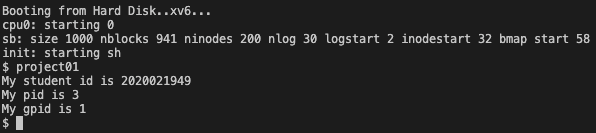

# OS Project01 Wiki

Author: 2020021949 구건모

이 프로젝트는 운영체제(ELE3021-11742)과목 Project01에 관한 문서입니다.  
이 문서는 다음 네 가지 정보를 담고 있습니다.

* Desin
* Implement
* Result
* Trouble shooting

## 1. Design

이 프로젝트에서는 다음 두 가지 feature를 구현하였습니다.

1. `getgpid` 시스템 콜
2. `getgpid`를 테스트할 수 있는 User progra

### getgpid

`getgpid`란 현재 실행 중인 프로세스를 기준으로 조부모 pid를 반환하는 시스템 콜입니다.

`xv6`에서 제공하는 `getpid`와 유사하지만, `getpid`는 현재 pid를 반환하는 반면, `getgpid`는 조부모 pid를 반환합니다.

### How to implement?

이 기능들 구현하기 위해선 먼저 새로운 시스템 콜을 추가해야 합니다. 다음 과정을 통해 시스템 콜을 추가할 수 있습니다.

> 기존에 존재하는 관련 시스템 콜을 관리하는 파일(`sysproc.c`)에 추가할 수도 있지만, 이 프로젝트에서는 별도로 파일을 만들어 관리했습니다. 이유는 `getgpid` 라는 함수의 사용성과 `sysproc.c`에 존재하는 system call의 사용성 측면에서 어울리지 않는 함수라고 판단했습니다.

1. `getgpid` 시스템 콜을 구현하기 위한 별도 파일을 생성합니다. (`rn_syscall.c`)
2. `rn_syscall.c`에 `getgpid` 함수를 구현합니다.
3. `getgpid`를 system call에 등록하기 위한 `wrapper function`을 구현합니다.
4. `Makefile`에 `rn_syscall.c`를 추가합니다.
5. `defs.h`에 `getgpid` 시스템 콜의 declaration(calling convention)을 추가합니다.
6. `syscall.h`에 `getgpid` 시스템 콜 번호를 추가합니다.
7. `syscall.c`에 `getgpid` 시스템 콜을 호출할 수 있도록 추가합니다.
8. `user.h`에 `getgpid` 시스템 콜의 declaration(calling convention)을 추가합니다.
9. `usys.S`에 `getgpid`를 시스템 콜로 사용할 수 있도록 macro를 추가합니다.

시스템 콜을 추가했다면 시스템 콜을 테스트해볼 수 있는 유저 프로그램을 작성해야 합니다. 다음 과정을 통해 유저 프로그램을 작성할 수 있습니다.

1. 시스템 콜을 테스트해볼 수 있는 프로그램을 작성하기 위한 별도 파일을 생성합니다. (`project01.c`)
2. `getgpid` 시스템 콜을 호출하며 테스트할 수 있는 코드를 작성합니다.
3. `Makefile`에 `project01.c`를 유저 어플리케이션으로 추가합니다.
4. 빌드 후 테스트합니다.

위와 같이 시스템 콜을 만들고 테스트해볼 수 있습니다.

## 2. Implement

시스템 콜을 등록하거나 declaration(calling convention)을 추가하는 부분은 동일하기 때문에 별도 분석이 필요하지 않았습니다.

> 새로운 시스템 콜을 등록할 때 특별한 방법을 적용한 것도 없고, `1. Design - How to implement?` 파트에서 설명한 방법을 따랐습니다. 따라서, 컴파일을 위한 `Makefile` 설정과 시스템 콜을 등록하는 부분은 서술하지 않았습니다.

### getpid

`getgpid`를 구현하기 전 이와 비슷한 `getpid`를 분석했습니다.

```c
int
sys_getpid(void)
{
  return myproc()->pid;
}
```

`getpid`는 `myproc` function을 통해 현재 프로세스를 가져온 후, 해당 프로세스의 pid를 반환하는 구조입니다.

우리는 현재 프로세스의 pid가 필요한 것이 아닌 조부모 프로세스의 pid가 필요하기 때문에, `myproc`이 어떤 객체를 반환하는지 확인해야 합니다.

### myproc

`myproc`은 현재 프로세스 객체를 반환합니다. 해당 객체는 다음과 같은 구조를 가지고 있습니다.

```c
// Per-process state
struct proc {
  uint sz;                     // Size of process memory (bytes)
  pde_t* pgdir;                // Page table
  char *kstack;                // Bottom of kernel stack for this process
  enum procstate state;        // Process state
  int pid;                     // Process ID
  struct proc *parent;         // Parent process
  struct trapframe *tf;        // Trap frame for current syscall
  struct context *context;     // swtch() here to run process
  void *chan;                  // If non-zero, sleeping on chan
  int killed;                  // If non-zero, have been killed
  struct file *ofile[NOFILE];  // Open files
  struct inode *cwd;           // Current directory
  char name[16];               // Process name (debugging)
};
```

프로세스는 최초 생성되는 `init` 프로세스를 제외한 모든 프로세스는 `fork`, `vfork`, `clone` 등을 통해 생성됩니다. 하지만 `xv6`에서는 `fork`만 지원하므로 `fork`를 통해 `proc` 객체에 어떤 값이 채워지는지 분석해 보겠습니다.

### fork

`fork`는 다음 로직으로 동작합니다.

```c
// Create a new process copying p as the parent.
// Sets up stack to return as if from system call.
// Caller must set state of returned proc to RUNNABLE.
int
fork(void)
{
  int i, pid;
  struct proc *np;
  struct proc *curproc = myproc();

  // Allocate process.
  if((np = allocproc()) == 0){
    return -1;
  }

  // Copy process state from proc.
  if((np->pgdir = copyuvm(curproc->pgdir, curproc->sz)) == 0){
    kfree(np->kstack);
    np->kstack = 0;
    np->state = UNUSED;
    return -1;
  }
  np->sz = curproc->sz;
  np->parent = curproc;
  *np->tf = *curproc->tf;

  // Clear %eax so that fork returns 0 in the child.
  np->tf->eax = 0;

  for(i = 0; i < NOFILE; i++)
    if(curproc->ofile[i])
      np->ofile[i] = filedup(curproc->ofile[i]);
  np->cwd = idup(curproc->cwd);

  safestrcpy(np->name, curproc->name, sizeof(curproc->name));

  pid = np->pid;

  acquire(&ptable.lock);

  np->state = RUNNABLE;

  release(&ptable.lock);

  return pid;
}
```

새로운 자식 프로세스를 생성하고 현재 프로세스를 새로운 프로세스의 부모로 설정합니다. 따라서 `proc` 객체에 존재하는 `parent`를 통해 부모 프로세스에 접근할 수 있습니다.

### getgpid

`getgpid`를 구현하기 위한 모든 분석이 끝났습니다. 현재 프로세스 객체를 얻어와 부모 프로세스의 부모 프로세스를 찾아 해당 프로세스의 pid를 반환하면 됩니다.

```c
int getgpid(void) {
    return myproc()->parent->parent->pid;
}
```

이때 parent 객체 혹은 parent->parent 객체가 `NULL`인지 아닌지를 체크하는게 안정적입니다.

하지만, getgpid를 사용하는 프로그램은 `init` > `sh` > `user_app` 으로 실행되기 때문에 `init` 프로세스가 `getgpid`를 사용하는 어플리케이션을 실행하지만 않는다면 별도로 검사하지 않아도 된다고 판단했습니다.

### user app for testing getgpid

`getgpid`를 테스트할 수 있는 유저 프로그램을 작성해야 합니다. 프로젝트에서 요구한대로 간단하게 작성했습니다.

```c
#include "types.h"
#include "stat.h"
#include "user.h"

int main(int argc, char** argv) {
    printf(1, "My student id is 2020021949\n");
    printf(1, "My pid is %d\n", getpid());
    printf(1, "My gpid is %d\n", getgpid());
    exit();
}
```

해당 유저 앱을 실행하고 결과를 확인하면 `getgpid`가 정상적으로 동작하는지 확인할 수 있습니다.

## 3. Result

`getgpid`를 구현하고 테스트한 결과, 정상적으로 동작하는 것을 확인할 수 있었습니다.



위 실행 과정은 다음과 같이 동작합니다.

1. xv6가 실행됩니다. (init process 생성) - pid = 1
2. sh이 실행되어 유저 입력을 받는 상태가 됩니다. - pid = 2
3. `project01`을 실행합니다. - pid = 3
4. `project01`은 `getpid`를 호출하여 자신의 pid를 출력합니다. - pid = 3
5. `project01`은 `getgpid`를 호출하여 부모 프로세스의 부모 프로세스의 pid를 출력합니다. - pid = 1

따라서 getgpid가 정상적으로 동작하는 것을 확인할 수 있습니다.

직접 컴파일 및 실행하려면 다음 명령어를 사용하면 됩니다. 이후 xv6 내부에서 `project01`을 실행하면 위와 같은 결과를 확인할 수 있습니다.

```shell
 $ sh boot.sh
```

## 4. Trouble shooting

이번 과제는 복잡한 로직이나 분석을 요하지 않았기 때문에 큰 어려움은 없었습니다. 코드를 구현하는 시간보다 `xv6`의 코드를 찾아보는 과정에서 시간이 많이 소모됐습니다.

다양한 검색 기능을 활용해 시간을 절약할 수 있었습니다. 또, 기존에 알고있던 Unix 계열 운영체제 구조와 비교하며 어떤 부분을 찾아봐야 하는지 예상할 수 있었기 때문에 빠르게 문제를 해결할 수 있었습니다.
