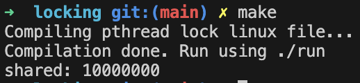

# OS Project02 Wiki

Author: 2020021949 구건모

이 프로젝트는 운영체제(ELE3021-11742)과목 Project03 - Locking에 관한 문서입니다.  
이 문서는 다음 네 가지 정보를 담고 있습니다.

* Desin
* Implement
* Result
* Trouble shooting

## 1. Design

Locking을 구현하기 위해선 Critical Section (Lock 잡기) 의 Mutual Exclusive를 보장하는 알고리즘을 작성하거나, Atomic H.W를 사용해서 해결해야 합니다.

이번 과제에서는 Atomic H.W를 이용해서 구현하기로 결정했습니다.

## 2. Implement

구현된 lock, unlock은 다음과 같습니다.

```c
volatile int mutex = 0;

void lock() {
    volatile int key = 1;
    for (; key != 0; ) {
        __asm__ __volatile__(
            "xchg %0, %1\n"
            : "+m" (mutex), "+r" (key)
        );
        if (key) sleep(0); // yield for speed up
    }
}

void unlock() {
    mutex = 0;
}
```

`lock`함수는 다음과 같이 동작합니다.

1. `key`를 1로 초기화합니다.
2. `key`가 0이 될 때까지 다음을 반복합니다.
    1. `mutex`와 `key`를 교환합니다.
    2. 이떄 `mutex`와 `key`는 Atomic하게 교환됩니다. (즉, race condition 이 발생하지 않음)
    3. \_\_volatile\_\_ 키워드를 사용하여, 컴파일러가 최적화하지 않도록 합니다. (컴파일러가 최적화하면, 어떤 일이 발생할 지 모르기 때문입니다.)
3. `key`가 0이 되면 `mutex`값이 0 -> 1이 되었다는 뜻이므로, 아무도 사용하고 있지 않은 lock을 잡은 상태가 됩니다.
4. `key`, `mutex`를 volatile로 설정한 이유도, 컴파일러가 최적화하지 않도록 하기 위함입니다. (컴파일러가 최적화하면, 어떤 일이 발생할 지 모르기 때문입니다.)

위 방식으로 구현한 `lock`은 `mutex`값을 변경할 때 race condition이 발생하지 않으므로, Critical Section에 대한 Mutual Exclusive를 보장합니다.

따라서, lock은 항상 한 명만 사용할 수 있음을 보장할 수 있습니다.

`unlock`함수는 `read`, `add`, `write` 처럼 race condition이 발생할 수 있는 연산이 아닌, 단순 대입연산이므로, mutual exclusive를 보장할 필요가 없습니다. (자동으로 보장됨)

또한, unlock을 호출하는 시점은, 항상 `lock`을 잡은 사람만 호출해야 한다는 가정 하에 단순 대입 연산만으로 구현했습니다.

이렇게 구현하면 다음 두 가지 상황에 대해 고려해야 합니다.

1. 다른 누군가 `lock`을 잡은 상황에서, `lock`을 잡지 않은 사람이 `unlock`을 호출하는 경우
2. `lock`이 잡혀있지 않은 상태에서 `unlock`을 호출하는 경우가 있을 수 있습니다.

1번 상황의 경우, 의도적으로 다른 사람이 `unlock`을 호출할 수도 있기 때문에 알 방법도 없고 알 필요도 없습니다.

2번 상황의 경우, `unlock`을 호출해서 생기는 문제점은 없고, 코드를 작성하는 유저의 잘못이기 때문에 별도 처리를 하지 않았습니다.

---

따라서, 이렇게 구현한 `lock`, `unlock`은 Critical Section을 안전하게 보장하는 Locking임을 보장할 수 있습니다.

## 3. Result

주어진 코드(`pthread_lock_linux.c`)에서 `NUM_ITERS`와 `NUM_THREADS` 값을 적절히 조정하며 테스트해볼 수 있습니다.

아래 결과는, `NUM_ITERS = 10000`, `NUM_THREADS = 1000`인 경우 실행 결과입니다.

Critical Section이 잘 보장되어 10000 * 1000이 출력되는 것을 확인할 수 있습니다.



주어진 코드 말고도, 다음과 같이 lock, unlock을 잡으며 테스트해볼 수도 있습니다.

```c
for (int i = 0; i < NUM_ITERS; ++i) {
    lock();
    ++shared_resource;
    unlock();
}
```

위 방식도 잘 동작하는 것을 확인할 수 있습니다.

직접 컴파일 및 실행하려면 다음 명령어를 사용하면 됩니다.

```shell
 locking$ make
```

## 4. Trouble shooting

처음에는 수업 시간에 배운 피터슨 알고리즘 등을 적용하려고 했으나, 수업 시간에 배운 피터슨 알고리즘은, 쓰레드가 두 개일때를 가정하고 문제를 해결하고 있습니다. 쓰레드가 여러 개가 된다면, 피터슨 알고리즘을 적용하기 어려웠습니다. 물론 bitmask를 활용하면 64개 쓰레드까진 처리할 수 있지만, 쓰레드가 더 많아진다면, bitmask를 적용한 피터슨 알고리즘도 적용하기 어렵습니다.

정보를 찾아보니, 피터슨 알고리즘을 n개 쓰레드에 대해 normalize하는 방법이 존재하긴 했으나, 모던한 칩에서는 대부분 atomic한 명령어를 사용할 수 있기에 overkill이라고 생각했습니다.

따라서, atomic한 명령어를 사용하기로 했고, 기존에 Assembly와 Inline Assembly를 사용해본 경험이 있어서, 어렵지 않게 구현할 수 있었습니다.
