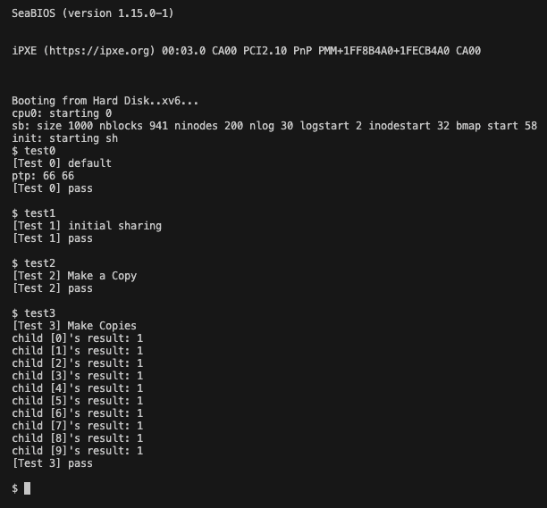

# OS Project02 Wiki

Author: 2020021949 구건모

이 프로젝트는 운영체제(ELE3021-11742)과목 Project04에 관한 문서입니다.  
이 문서는 다음 네 가지 정보를 담고 있습니다.

* Desin
* Implement
* Result
* Trouble shooting

## 1. Design

이 프로젝트에서는 다음 세 가지 feature를 구현하였습니다.

1. 과제 명세에 나온 User Memory Shallow Copy, Copy on Write 구현
2. Shallow Copy 및 Page Fault (CoW) 발생 시, 페이지 관리가 제대로 이루어지는지 확인할 수 있는 시스템 콜 구현
3. 이를 테스트해볼 수 있는 유저 프로그램 작성

### CoW

Copy on Write는 다음과 같은 상황에서 필요합니다.

기존의 프로세스 fork는 다음과 같이 동작합니다.

1. `fork` 호출
2. 부모 프로세스의 전체 메모리 영역을 복사해서 자식 프로세스 생성

하지만, `fork`를 호출할 때, 대부분 `fork - exec`로 새로운 프로세스를 만들기 위해 사용합니다.

따라서, 크기가 큰 부모에서 `fork - exec`로 자식을 생성하면, 메모리를 복사하는데 시간이 오래 걸립니다. 또, 사용할 수 있는 메모리 영역을 넘어간다면, 실제로 `exec`로 할당할 수 있는 프로그램이 있음에도 불구하고, `fork`에서 실패할 수 있습니다.

따라서 다음과 같이 변경합니다.

1. `fork` 호출
2. 부모 프로세스와 자식 프로세스 모두 같은 물리 페이지를 참조하며, 쓰기 권한 삭제 (Page Fault 발생) (참조 횟수 관리)
3. 부모 혹은 자식이 페이지를 쓰려고 할 때, 쓰기 권한이 없으므로 Page Fault 발생
4. Page Fault가 발생하면 핸들러에서 다음 과정을 처리합니다.
   1. 참조 횟수가 1이라면 현재 프로세스만 사용하고 있다는 뜻이므로, 쓰기 권한을 부여하고 원래 프로세스로 돌아갑니다.
   2. 참조 횟수가 2 이상이면, 여러 프로세스가 참조하고 있다는 뜻이므로, 새로운 페이지를 할당받아 복사한 뒤, 페이지를 연결해주고 원래 프로세스로 돌아갑니다.
  
이렇게 처리하면, `fork - exec` 과정에서 모든 메모리 공간을 복사할 필요 없이 처리할 수 있습니다. 또한, 멀티 프로세싱을 위한 `fork`에도, 실제 코드 영역은 공유하도록 처리하고, 실제 복사가 필요한 페이지도 lazy하게 처리하므로, 응답 속도가 빨라집니다. (Locality 때문)

### User Memory Shallow Copy

기존 `fork`에서는 Deep Copy를 하지만 (전체 메모리 영역 복사) 이 부분을 Shallow Copy로 변경합니다. 이때, 페이지 디렉토리와 페이지 테이블은 새로 할당받아야 합니다.

Shallow Copy란, 부모 프로세스가 사용하고 있는 물리 페이지를 자식 프로세스가 참조하도록 하는 것입니다. 이후 부모와 자식 모두 쓰기 권한을 삭제합니다. 이후 물리 페이지에 대해 참조 횟수를 늘려줍니다.

### CoW Handler

Shallow Copy를 진행하면, 물리 페이지에 쓰기 작업을 할 때, Page Fault가 발생합니다. 이때, Page Fault Handler를 통해 다음과 같은 작업을 진행합니다.

1. 해당 물리 페이지의 참조 횟수를 확인합니다.
2. 참조 횟수가 1이라면, 쓰기 권한을 부여하고 원래 프로세스로 돌아갑니다.
3. 참조 횟수가 2 이상이면, 새로운 페이지를 할당받아 복사한 뒤, 페이지를 연결해주고 원래 프로세스로 돌아갑니다.

### System Call for Testing Application

CoW를 테스트하기 위한 위한 시스템 콜은 다음과 같습니다.

* `countfp`: 현재 시스템에 존재하는 free page 개수를 반환합니다.
* `countvp`: 현재 프로세스가 할당받은 virtual page 개수를 반환합니다.
* `countpp`: 현재 프로세스가 할당받은 physical page 개수를 반환합니다.
* `countptp`: 현재 프로세스가 시스템에 의해 할당받은 (page table의) page 개수를 반환합니다.

### How to implement?

물리 페이지를 공유하기 위해서는 해당 물리 페이지가 어떤 프로세스에 의해 참조되고 있는지 알아야 합니다. 따라서, 물리 페이지에 대한 참조 횟수를 관리해야 합니다. 이를 위해 `kalloc.c`에 존재하는 `kmem` 구조체를 수정해서 관리합니다.

따라서, `kalloc` 함수에서는 할당하는 페이지 참조 횟수를 1로 초기화 하는 과정을 추가하고, `kfree`에서는 할당 해제하려는 페이지가 실제 참조하는 페이지가 없어질 때만 페이지를 반납하도록 수정해야 합니다.

또, Page Fault가 발생했을 때 처리할 수 있도록, `trap.c`에서 Page Fault Handler를 추가해야 합니다.

CoW 관련 코드를 작성했다면 다음과 같이 유저 테스트 코드를 작성할 수 있습니다. (시스템 콜을 등록하는 부분은 Project01에 나와있으므로 생략했습니다.)

1. 프로세스를 생성하고, 몇 페이지나 할당됐는지 기록합니다. 또, `sbrk` 등을 활용해서 새로운 페이지를 할당받고 페이지가 잘 할당 됐는지 확인합니다.
2. 이후 자식 `fork` 등을 진행하며 공유(Shallow Copy)가 잘 되는지, Page Fault가 발생했을 때 페이지를 잘 분리해서 가져오는지 확인합니다.
3. 이렇게 여러 상황에 대해 테스트를 진행합니다.

## 2. Implement

`CoW`를 구현하려면 가장 기본적인 기능부터 구현해야 합니다.

특정 페이지가, 프로세스 몇 개에 의해 참조되고 있는지 알아야 하므로, 물리 페이지에 대한 참조 횟수를 관리해야 합니다.

따라서, 현재 페이지를 할당 및 관리하는 `kalloc` 관련 함수들을 수정해야 합니다.

### kmem

기존의 `kmem`은 다음과 같습니다.

```c
//FILE: kalloc.c

struct run {
  struct run *next;
};

struct {
  struct spinlock lock;
  int use_lock;
  struct run *freelist;
} kmem;
```

`kmem`에서 free page만 관리하지 않고, 참조 횟수도 관리하기 위해 다음과 같이 수정합니다.

```c
struct run {
  struct run *next;
};

struct {
  struct spinlock lock;
  int use_lock;
  struct run *freelist;

  // count the number of references to each physical page
  int refcount[PHYSTOP >> LGPGSIZE];
} kmem;
```

`refcount` 배열은 물리 페이지의 참조 횟수를 관리하기 위한 배열입니다. 물리 페이지 번호를 인덱스로 접근해 참조 횟수를 관리합니다. `PHTSTOP >> LGPGSIZE`는 최대 물리 페이지 개수를 나타냅니다. `57344`개이므로 배열로 관리해도 충분합니다.

> 버추얼 페이지 번호로 관리할 수도 있지만, 물리 페이지가 0부터 `PHYSTOP`까지 순차적으로 할당되기 때문에, 물리 페이지 번호로 관리하는 것이 편리합니다.

> `LGPGSIZE`는 `PGSIZE`의 밑이2인 로그 값입니다. `PGSIZE`는 4096이므로, `LGPGSIZE`는 12입니다. `mmu.h`에서 확인할 수 있습니다.

### kalloc

참조 횟수를 관리할 자료구조를 추가했으니, 기존 모든 페이지에서 참조 횟수를 관리해줘야 합니다.

따라서, `kalloc`에서 참조 횟수를 초기화해주는 로직을 추가해야 합니다.

```c
//FILE: kalloc.c

// Allocate one 4096-byte page of physical memory.
// Returns a pointer that the kernel can use.
// Returns 0 if the memory cannot be allocated.
char*
kalloc(void)
{
  struct run *r;

  if (kmem.use_lock) acquire(&kmem.lock);

  r = kmem.freelist;
  if (r) {
    kmem.refcount[V2P(r) >> LGPGSIZE] = 1;
    kmem.freelist = r->next;
  }

  if (kmem.use_lock) release(&kmem.lock);
  return (char*)r;
}
```

`kalloc` 함수에서는 페이지를 할당할 때, 참조 횟수를 1로 초기화해줍니다.

### kfree

`kfree` 함수에서는 페이지를 해제할 때, 참조 횟수를 관리해줘야 합니다.

```c
//FILE: kalloc.c

//PAGEBREAK: 21
// Free the page of physical memory pointed at by v,
// which normally should have been returned by a
// call to kalloc().  (The exception is when
// initializing the allocator; see kinit above.)
void
kfree(char *v)
{
  struct run *r;

  if ((uint)v % PGSIZE || v < end || V2P(v) >= PHYSTOP)
    panic("kfree");

  if (kmem.use_lock) acquire(&kmem.lock);

  if (--kmem.refcount[V2P(v) >> LGPGSIZE] > 0) {
    if (kmem.use_lock) release(&kmem.lock);
    return;
  }

  // Fill with junk to catch dangling refs.
  memset(v, 1, PGSIZE);

  r = (struct run*)v;
  r->next = kmem.freelist;
  kmem.freelist = r;
  if (kmem.use_lock) release(&kmem.lock);
}
```

`kfree`에서 중요한 점은, 아직 해당 페이지를 참조하고있는 다른 프로세스가 존재할 경우, 페이지를 할당 해제하지 않고 넘어가야 합니다.

따라서, 참조 횟수를 감소시킨 뒤, 참조 횟수가 0 초과라면, 페이지를 할당 해제하지 않고 넘어가도록 합니다.

이때, `kinit1`, `kinit2` 에서 초기 free page를 만들기 위해 `kfree`를 사용하는데, 이때 음수가 될 수 있다는 사실에 주의해야 합니다. 따라서 0 이하라면, free page로 반납합니다.

> 이때, 음수가 돼도 상관 없는 이유는 `kalloc`에서 참조 횟수를 1로 설정해주기 때문에 실제 사용하는데는 문제없기 때문입니다.

---

참조 횟수를 관리할 자료구조와 `kalloc`, `kfree`를 만들었으므로, 이를 외부에서도 관리할 수 있도록 다음 세 가지 함수를 추가합니다.

1. `incr_refc`: 물리 페이지의 참조 횟수를 증가시킵니다.
2. `decr_refc`: 물리 페이지의 참조 횟수를 감소시킵니다.
3. `get_refc`: 물리 페이지의 참조 횟수를 반환합니다.

### incr_refc

```c
//FILE: kalloc.c

// Increment the reference count of a physical page
void incr_refc(uint pa) {
  if (pa % PGSIZE || (char*)pa < end || V2P(pa) >= PHYSTOP)
    panic("incr_refc");

  if (kmem.use_lock) acquire(&kmem.lock);

  ++kmem.refcount[V2P(pa) >> LGPGSIZE];

  if (kmem.use_lock) release(&kmem.lock);
}
```

### decr_refc

```c
// Decrement the reference count of a physical page
void decr_refc(uint pa) {
  if (pa % PGSIZE || (char*)pa < end || V2P(pa) >= PHYSTOP)
    panic("decr_refc");

  if (kmem.use_lock) acquire(&kmem.lock);

  --kmem.refcount[V2P(pa) >> LGPGSIZE];

  if (kmem.use_lock) release(&kmem.lock);
}
```

### get_refc

```c
// Get the reference count of a physical page
int get_refc(uint pa) {
  int refc;

  if (pa % PGSIZE || (char*)pa < end || V2P(pa) >= PHYSTOP)
    panic("get_refc");  

  if (kmem.use_lock) acquire(&kmem.lock);

  refc = kmem.refcount[V2P(pa) >> LGPGSIZE];

  if (kmem.use_lock) release(&kmem.lock);

  return refc;
}
```

---

이제, `CoW`를 구현하기 위한 준비는 마쳤습니다.

`CoW`를 구현하기 이전 기존의 프로세스를 생성하는 `fork` 코드를 분석해보겠습니다.

### (Origin) fork

fork 함수는 다음과 같이 구현되어 있습니다.

```c
//FILE: proc.c

// Create a new process copying p as the parent.
// Sets up stack to return as if from system call.
// Caller must set state of returned proc to RUNNABLE.
int
fork(void)
{
  int i, pid;
  struct proc *np;
  struct proc *curproc = myproc();

  // Allocate process.
  if((np = allocproc()) == 0){
    return -1;
  }

  // Copy process state from proc.
  if((np->pgdir = copyuvm(curproc->pgdir, curproc->sz)) == 0){
    kfree(np->kstack);
    np->kstack = 0;
    np->state = UNUSED;
    return -1;
  }
  np->sz = curproc->sz;
  np->parent = curproc;
  *np->tf = *curproc->tf;

  // Clear %eax so that fork returns 0 in the child.
  np->tf->eax = 0;

  for(i = 0; i < NOFILE; i++)
    if(curproc->ofile[i])
      np->ofile[i] = filedup(curproc->ofile[i]);
  np->cwd = idup(curproc->cwd);

  safestrcpy(np->name, curproc->name, sizeof(curproc->name));

  pid = np->pid;

  acquire(&ptable.lock);

  np->state = RUNNABLE;

  release(&ptable.lock);

  return pid;
}
```

기존 `fork`에서는 `copyuvm`함수를 통해 부모가 가지고 있는 모든 페이지를 자식에게 모두 복사해서 생성합니다.

하지만, `CoW`를 구현하기 위해서는 모든 페이지를 복사하지 말고, 부모의 페이지를 참조하도록 변경해야 합니다. 따라서, `copyuvm` 함수를 수정해야 합니다.

### shallow_copy_uvm

`copyuvm`함수처럼 동작하지만, 실제로 복사하는 것이 아닌, 동일한 물리 페이지를 참조하도록 복사해주는 함수입니다.

또한, 부모와 자식 모두 쓰기 권한을 없애줍니다.

```c
//FILE: vm.c

// Given a parent process's page table, create a shallow copy
// of it for a child.
// and make page table entries can't writeable;
pde_t* shallow_copy_uvm(pde_t* pgdir, uint sz) {
  pde_t* d;
  pte_t* pte;
  uint pa, i, flags;

  if ((d = setupkvm()) == 0) return 0;
  for (i = 0; i < sz; i += PGSIZE) {
    if ((pte = walkpgdir(pgdir, (void *)i, 0)) == 0)
      panic("shallow_copy_uvm: pte should exist");
    if (!(*pte & PTE_P))
      panic("shallow_copy_uvm: page not present");

    *pte &= ~PTE_W; // make page table entries can't writeable
    *pte |= PTE_COW; // set CoW flag

    pa = PTE_ADDR(*pte);
    flags = PTE_FLAGS(*pte);
    if (mappages(d, (void*)i, PGSIZE, pa, flags) < 0) goto bad;
    incr_refc((uint)P2V(pa));
  }

  // TLB Flush
  lcr3(V2P(d));
  lcr3(V2P(pgdir));

  return d;

bad:
  freevm(d);
  return 0;
}
```

`shallow_copy_uvm` 함수는 다음과 같이 동작합니다.

1. 새로운 페이지 디렉토리를 생성합니다.
2. 부모 페이지 디렉토리를 순회하며, 각 페이지 테이블 엔트리에 대해 다음을 진행합니다.
   1. 쓰기 권한을 없애줍니다.
   2. CoW 플래그를 설정합니다.
   3. 물리 주소를 가져와서, 새로운 페이지 디렉토리에 매핑합니다.
   4. 참조 횟수를 증가시킵니다.
3. TLB를 Flush합니다.

이렇게 하면, 부모와 자식 모두 같은 쓰기 권한이 없는 물리 페이지를 참조하게 됩니다. 따라서, 쓰기 작업을 할 때, Page Fault가 발생하게 됩니다.

이후, fork에서 `copyuvm`으로 호출하는 부분을 `shallow_copy_uvm`으로 변경하면 됩니다.

> CoW 플래그는 Page Fault Handler에서 더 안전하게 처리하기 위해 추가했습니다. `PTE_COW` 플래그는 `mmu.h`에서 확인할 수 있습니다.

### Page Fault Trap

이제, 변경된 `fork` 함수로 운영체제를 시작한다면, Page Fault가 발생하게 됩니다. (읽기 전용 모드를 쓰려고 하기 때문) 현재는 Page Fault Handler가 없기 때문에 Kernel Panic이 발생합니다.

따라서, Page Fault Handler를 추가해야 합니다.

```c
//FILE: trap.c

//PAGEBREAK: 41
void
trap(struct trapframe *tf)
{
  if (tf->trapno == T_SYSCALL) {
    if (myproc()->killed) exit();
    myproc()->tf = tf;
    syscall();
    if (myproc()->killed) exit();
    return;
  }

  if (tf->trapno == T_PGFLT) { // page fault handler
    if (myproc()->killed) exit();
    CoW_handler();
    if (myproc()->killed) exit();
    return;
  }
  // ...
}
```

현재 CoW를 처리하기 위해서만 의도적으로 Page Fault를 내고 있습니다. 그 외에는 프로그램이 잘못된 경우입니다. 따라서, CoW만 처리하고, CoW가 아닌 페이지 폴트가 발생했을 경우 프로그램을 종료하도록 코드를 작성했습니다.

### CoW Handler

CoW Handler는 다음과 같이 동작합니다.

1. `rcr2`를 통해 Page Fault가 발생한 Logical Address를 가져옵니다.
2. 해당 주소가 프로세스에서 유효한 범위인지 확인합니다.
3. 해당 주소의 페이지 테이블 엔트리를 가져옵니다.
4. 해당 페이지가 CoW 페이지인지 확인합니다.
5. 해당 페이지의 물리 주소와 플래그를 가져옵니다.
6. 해당 페이지의 참조 횟수를 확인합니다.
7. 참조 횟수가 1이라면, 쓰기 권한을 부여하고 원래 프로세스로 돌아갑니다.
8. 참조 횟수가 2 이상이면, 새로운 페이지를 할당받아 복사한 뒤, 페이지를 연결해주고 원래 프로세스로 돌아갑니다. (이후 참조 횟수를 감소시킵니다.)
9. TLB를 Flush합니다.

이 과정에서 유효하지 않은 Page Fault가 발생하거나, CoW 페이지가 아닌 페이지에 대해 Page Fault가 발생하면 프로세스를 Kill 시킵니다.

```c
//FILE: vm.c

// page fault handler
void CoW_handler(void) {
  uint va;
  struct proc* curproc = myproc();
  pte_t* pte;
  char* mem;
  uint pa;
  uint flags;


  va = rcr2();
  if (va >= curproc->sz) {
    curproc->killed = 1;
    cprintf("Page Fault: va >= curproc->sz - va: %d / curproc->sz: %d\n", va, curproc->sz);
    return;
  }
  pte = walkpgdir(curproc->pgdir, (void*)va, 0);
  if (!(*pte & PTE_COW)) {
    curproc->killed = 1;
    cprintf("Page Fault: page is not CoW\n");
    return;
  }

  pa = PTE_ADDR(*pte);
  flags = PTE_FLAGS(*pte);

  if (get_refc((uint)P2V(pa)) == 1) {
    *pte &= ~PTE_COW;
    *pte |= PTE_W;
    // TLB Flush
    lcr3(V2P(curproc->pgdir));
    return;
  }
  decr_refc((uint)P2V(pa));

  if ((mem = kalloc()) == 0) {
    panic("CoW_handler: kalloc failed");
  }
  memmove(mem, (char*)P2V(pa), PGSIZE);
  if ((pte = walkpgdir(curproc->pgdir, (void*)va, 0)) == 0) {
    kfree(mem);
    panic("CoW_handler: walkpgdir failed");
  }

  *pte = V2P(mem) | flags | PTE_P | PTE_W | PTE_U;
  *pte &= ~PTE_COW;

  // TLB Flush
  lcr3(V2P(curproc->pgdir));
}
```

이렇게 구현하면, CoW가 정상적으로 작동하는 것을 확인할 수 있습니다.

---

### System Call for Testing Application

CoW가 잘 작동하는지 테스트하기 위해 다음 네 가지 시스템 콜을 추가했습니다.

* `countfp`: 현재 시스템에 존재하는 free page 개수를 반환합니다.
* `countvp`: 현재 프로세스가 할당받은 virtual page 개수를 반환합니다.
* `countpp`: 현재 프로세스가 할당받은 physical page 개수를 반환합니다.
* `countptp`: 현재 프로세스가 시스템에 의해 할당받은 (page table의) page 개수를 반환합니다.

### countfp

```c
//FILE: kalloc.c

int sys_countfp(void) {
  int fps;
  struct run* r;

  if (kmem.use_lock) acquire(&kmem.lock);

  fps = 0;
  r = kmem.freelist;
  for (; r; ) {
    ++fps;
    r = r->next;
  }

  if (kmem.use_lock) release(&kmem.lock);

  return fps;
}
```

### countvp

```c
//FILE: kalloc.c

int sys_countvp(void) {
  return myproc()->sz / PGSIZE;
}
```

### countpp

```c
//FILE: vm.c

int sys_countpp(void) {
  int pps;
  uint va;
  pte_t* pte;

  pps = 0;
  for (va = 0; va < myproc()->sz; va += PGSIZE) {
    if ((pte = walkpgdir(myproc()->pgdir, (void*)va, 0)) == 0)
      panic("sys_countpp: walkpgdir failed");
    if ((uint)*pte & PTE_P) {
      ++pps;
    }
  }

  return pps;
}
```

### countptp

countptp를 구현하기 위해서는, `page table` 혹은 `page directory`가 할당받은 페이지를 세야 합니다.

코드를 분석해보면 알 수 있듯이 `page table` 혹은 `page directory`는 새로운 `pte` 혹은 `pde`를 할당받기 위해서 `walkpgdir`의 `alloc`을 1로 주어 `walkpgdir`에서만 할당받습니다. 따라서, `walkpgdir`에서 할당받은 페이지를 세면 됩니다.

`walkpgdir`에서 할당받은 페이지임을 기록하기 위해 `PTE_PTE`라는 플래그를 만들어 사용합니다.

```c
//FILE: vm.c

// Return the address of the PTE in page table pgdir
// that corresponds to virtual address va.  If alloc!=0,
// create any required page table pages.
static pte_t *
walkpgdir(pde_t *pgdir, const void *va, int alloc)
{
  pde_t *pde;
  pte_t *pgtab;

  pde = &pgdir[PDX(va)];
  if(*pde & PTE_P){
    pgtab = (pte_t*)P2V(PTE_ADDR(*pde));
  } else {
    if(!alloc || (pgtab = (pte_t*)kalloc()) == 0)
      return 0;
    // Make sure all those PTE_P bits are zero.
    memset(pgtab, 0, PGSIZE);
    // The permissions here are overly generous, but they can
    // be further restricted by the permissions in the page table
    // entries, if necessary.
    *pde = V2P(pgtab) | PTE_P | PTE_W | PTE_U | PTE_PTE;
  }
  return &pgtab[PTX(va)];
}
```

기존 `walkpgdir` 함수에서 `PTE_PTE` 플래그를 추가했습니다. `PTE_PTE` 플래그는 `mmu.h`에서 확인할 수 있습니다.

따라서 할당받은 모든 `pde`와 `pte`를 순회하면서 `PTE_PTE` 플래그가 켜진 페이지 개수를 세면 됩니다.

```c
//FILE: kalloc.c

int sys_countptp(void) {
  int count;
  struct proc* curproc;

  curproc = myproc();
  count = 1; // for pgdir's page

  for (int i = 0; i < NPDENTRIES; ++i) {
    if (curproc->pgdir[i] & PTE_PTE) {
      ++count;

      pte_t *pgtab = (pte_t*)P2V(PTE_ADDR(curproc->pgdir[i]));
      for (int j = 0; j < NPTENTRIES; ++j) {
        if (pgtab[j] & PTE_PTE) {
          ++count;
        }
      }
    }
  }
  return count;
}
```

> 이때 count를 1부터 시작하는 이유는, `pgdir`이 저장될 페이지 개수도 포함되어야 하기 때문입니다. `pgdir`은 walkpgdir로 할당받지 않고, `setupkvm`에서 할당받기 때문에 `PTE_PTE` 플래그가 포함되지 않기 떄문입니다.

### User App for Testing CoW

CoW가 잘 동작하는지 확인하기 위해 다음과 같은 테스트 프로그램을 작성할 수 있습니다.

`test0.c`, `test1.c`, `test2.c`, `test3.c` 파일에서 확인할 수 있습니다.

해당 코드는 명세에서 제공한 테스트입니다.

테스트를 통해 페이지가 잘 관리되는지 확인할 수 있습니다.


#### test 1

1. `countfp`, `countvp`, `countpp`, `countptp`를 통해 페이지가 잘 할당되고 관리되는지 확인합니다.
2. `sbrk`를 이용해 추가적인 페이지가 잘 할당됐는지 확인합니다.

#### test 2

1. `fork`를 통해 자식 프로세스를 생성합니다.
2. 자식 프로세스와 부모 프로세스가 같은 물리 페이지를 가리키고있는지, 페이지 개수 차이를 통해 확인합니다.

#### test 3

1. `fork`를 통해 자식 프로세스를 생성합니다.
2. 자식 프로세스가 부모 프로세스와 공유하고있는 변수를 수정하여 새로운 물리 페이지를 할당받는지 확인합니다.

#### test 4

1. `fork`를 통해 자식 프로세스를 생성합니다.
2. 자식 프로세스를 10개 생성하고, 각각의 자식 프로세스는 test3과 유사하게 부모와 공유하는 변수를 수정합니다.
3. 각각의 자식 프로세스가 새로운 물리 페이지를 할당받는지 확인합니다.
4. 이후 모든 자식이 종료된 후 free page가 제대로 회수됐는지 확인합니다.

## 3. Result

테스트 앱을 구현하고 테스트한 결과, 정상적으로 동작하는 것을 확인할 수 있었습니다.

직접 컴파일 및 실행하려면 다음 명령어를 사용하면 됩니다. 이후 xv6 내부에서 `test0`, `test1`, `test2`, `test3`을 실행하면 위와 같은 결과를 확인할 수 있습니다.

```shell
 $ sh boot.sh
```

테스트 결과는 다음과 같습니다.



## 4. Trouble shooting

기존 linux system에서 사용하고있는 Memory Commit과 Copy on Write 기법이 어떤 방식으로 동작하는지 알고 있었습니다. 따라서, 수월하게 구현할 수 있었습니다.

다만, multi-level page table에서 관리하는 주소 체계가 중복해서 코드를 사용하기도 하고 (page directory와 page table이 entry를 관리하기 위한 코드가 동일함) logical -> virtual -> physical로 변환되는 과정에서 어떤 형태의 주소인지 헷갈려 잘못 작성하는 바람에 디버깅을 했습니다.

이때, if 조건으로 주소 체계 format이 맞지 않을 경우 panic을 발생하는 코드를 추가해서 쉽게 오류를 잡아낼 수 있었습니다.
